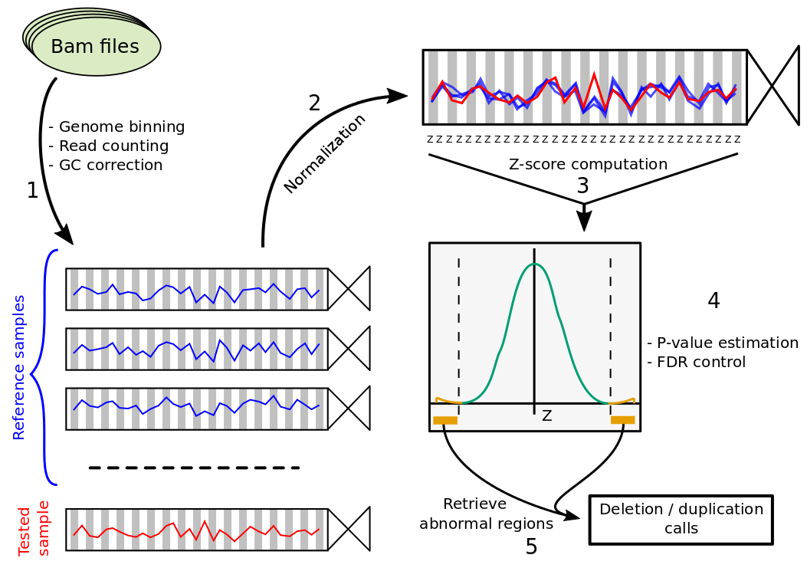

[](https://travis-ci.org/jmonlong/PopSV)
[](https://codecov.io/gh/jmonlong/PopSV)

# What is PopSV ?

PopSV is a Copy-Number Variation (CNV) detection method from high-throughput sequencing. 
Abnormal Read-Depth signal is detected by using a population of samples as reference. 
Thanks to this population view, the whole genome can be robustly interrogated, including regions of low mappability. 
Moreover, any divergence from the reference samples are detected, even if the signal is incomplete, e.g. tumoral aberrations or SV involving repeats.

The manuscript presenting the methods and an application to epilepsy patients was published in [PLoS Genetics](http://journals.plos.org/plosgenetics/article?id=10.1371/journal.pgen.1007285).

# Getting started

## Installation

This install command requires [*devtools* package](https://github.com/hadley/devtools) which can be easily installed with :

```r
install.packages("devtools")
```

Some [Bioconductor](http://bioconductor.org/) packages are also necessary and not installed automatically. Running the following command should be sufficient :

```r
source("http://bioconductor.org/biocLite.R")
biocLite("BSgenome.Hsapiens.UCSC.hg19", "Rsamtools", "DNAcopy", "rtracklayer")
```

*To use hg38 instead of hg19 install `BSgenome.Hsapiens.UCSC.hg38`.*

Then, run the following to install the latest development version:

```r
devtools::install_github("jmonlong/PopSV")
```

If you get an error, you can try the following instead:

```r
devtools::install_git("git://github.com/jmonlong/PopSV.git")
```

**R 3.1 or higher** is required.


## Usage

PopSV package is used as any R package, by simply loading the library and using the provided funtions.

```r
library(PopSV)
...
```

There are a few functions to run the CNV analysis and others to explore the results.

## I don't want to think, how can I run it quickly ?

After quickly [configuring *batchtools*](2-ClusterManagement.md#installation-and-configuration) for your computing cluster, you can run the [automated pipeline](2-ClusterManagement.md#automated-run):

```r
## Load package and wrapper
library(PopSV)
source("automatedPipeline-batchtools.R")
## Prepare file paths and bins
bam.files = read.table("bams.tsv", as.is=TRUE, header=TRUE)
files.df = init.filenames(bam.files, code="example")
save(files.df, file="files.RData")
bin.size = 1e3
bins.df = fragment.genome.hp19(bin.size)
save(bins.df, file="bins.RData")
## Run PopSV
res.GCcounts = autoGCcounts("files.RData", "bins.RData")
cnvs.df = autoNormTest("files.RData", "bins.RData")
```

In this example `bams.tsv` is a tab-delimited file with a column *sample* (with the sample names) and a column *bam* (with the path to each BAM file). The **BAM files must be sorted and indexed**.

In practice I run these commands in the login node of our HPC cluster because it sends jobs to the cluster. 
I also have this in a [*screen*](https://www.gnu.org/software/screen/manual/screen.html) so I can detach the screen, disconnect from the server and let it run on the background.

# Workflow



First the genome is fragmented and reads mapping in each bin are counted for each sample and GC corrected (1). Next, coverage of the sample is normalized (2) and each bin is tested by computing a Z-score (3), estimating p-values (4) and identifying abnormal regions (5).

A quick description of the different analysis steps and their corresponding functions can be found in [this page](1-BasicWorkflow.md).


# Running PopSV on computing clusters

PopSV workflow uses [*BatchJobs* package](https://github.com/tudo-r/BatchJobs) or its successor the [*batchtools* package](https://mllg.github.io/batchtools/) to send computations to a cluster. 
It needs some configuration but then it saves a lot of time and the pipeline can be run easily. 
For more information on how to configure these package for your HPC system, go to [this page](2-ClusterManagement.md).

# FAQ

Find frequently asked questions [there](5-FAQ.md). E.g. about reference samples, bin size, exome.
