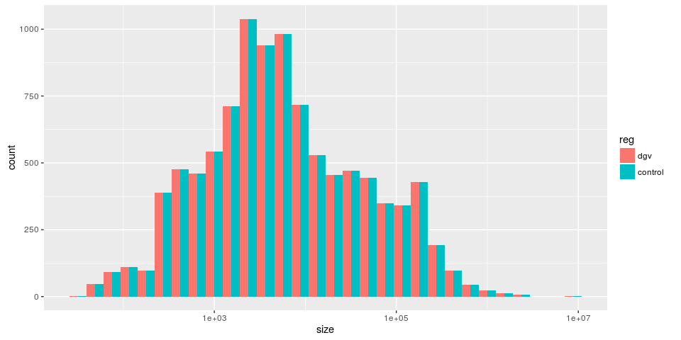

Constructing control regions for enrichment analysis
====================================================

Introduction
------------

When investigating enrichment in specific genomic features, it is common to compare the regions of interest with some controls regions. **A simple approach** to construct control regions could be to **randomly select regions across the genome**. Additionally, it is important for the control regions to have the **same size distribution**.

However, a random distribution across the genome is usually **not realistic**. Likely, regions in the genome were not tested because inaccessible or not included in the analysis. Moreover, **you might want to control for some patterns and look for more**.

For example, we first observed enrichment of CNVs in low-mappability regions. We then wanted to test additional enrichment in different repeat classes. Because repeats are enriched in low-mappability regions, repeats will likely be seen enriched in CNVs. We want to avoid spurious correlation and control for the low-mappability enrichment. By constructing control regions with the same low-mappability enrichment we can can test additional enrichment in the different repeat classes without being biased by the relation between low-mappability regions and repeats.

Constructing control regions with *PopSV* package
-------------------------------------------------

First we load the package and retrieve some annotations to play with.

``` {.r}
library(PopSV)
```

    ## Warning: replacing previous import by 'data.table::shift' when loading
    ## 'PopSV'

``` {.r}
library(AnnotationHub)
```

    ## Loading required package: BiocGenerics

    ## Loading required package: parallel

    ## 
    ## Attaching package: 'BiocGenerics'

    ## The following objects are masked from 'package:parallel':
    ## 
    ##     clusterApply, clusterApplyLB, clusterCall, clusterEvalQ,
    ##     clusterExport, clusterMap, parApply, parCapply, parLapply,
    ##     parLapplyLB, parRapply, parSapply, parSapplyLB

    ## The following objects are masked from 'package:stats':
    ## 
    ##     IQR, mad, xtabs

    ## The following objects are masked from 'package:base':
    ## 
    ##     anyDuplicated, append, as.data.frame, as.vector, cbind,
    ##     colnames, do.call, duplicated, eval, evalq, Filter, Find, get,
    ##     grep, grepl, intersect, is.unsorted, lapply, lengths, Map,
    ##     mapply, match, mget, order, paste, pmax, pmax.int, pmin,
    ##     pmin.int, Position, rank, rbind, Reduce, rownames, sapply,
    ##     setdiff, sort, table, tapply, union, unique, unlist, unsplit

``` {.r}
ah = AnnotationHub()
```

    ## snapshotDate(): 2016-01-14

``` {.r}
genes = ah[["AH49010"]] ## Genes
```

    ## require("GenomicRanges")

``` {.r}
dgv = ah[["AH5120"]] ## SVs from DGV
dgv = dgv[sample.int(length(dgv), 1e4)] ## Reduce to 10K random SVs
```

We imported a gene annotation and 10 thousands SVs from DGV. If we want to construct control regions that fit the SV size and overlap with genes, we run:

``` {.r}
dgv.cont = draw.controls(dgv, list(gene=genes), chr.prefix="chr")
```

Now let's verify that the size distribution is the same.

``` {.r}
library(ggplot2)
size.df = rbind(data.frame(reg="dgv", size=width(dgv)),
                 data.frame(reg="control", size=width(dgv.cont)))
ggplot(size.df, aes(x=size, fill=reg)) + geom_histogram(position="dodge")
```


``` {.r}
ggplot(size.df, aes(x=size, fill=reg)) + geom_histogram(position="dodge") + scale_x_log10()
```


 And that the input and output regions overlap genes similarly.

``` {.r}
mean(overlapsAny(dgv, genes))
```

    ## [1] 0.3991

``` {.r}
mean(overlapsAny(dgv.cont, genes))
```

    ## [1] 0.3995

`draw.controls` functions can **accept any number of genomic features to control**. Let's import two additional genomic annotation that we would like to control for our enrichment analysis: assembly gaps and segmental duplications.

``` {.r}
gap = ah[["AH6444"]]
segdups = ah[["AH5121"]]
dgv.cont2 = draw.controls(dgv, list(gene=genes, gap=gap, sd=segdups), chr.prefix="chr")
```

Again, the size distribution must be the same:

``` {.r}
## Same size distribution ?
size.df = rbind(data.frame(reg="dgv", size=width(dgv)),
                 data.frame(reg="control", size=width(dgv.cont2)))
ggplot(size.df, aes(x=size, fill=reg)) + geom_histogram(position="dodge")
```


``` {.r}
ggplot(size.df, aes(x=size, fill=reg)) + geom_histogram(position="dodge") + scale_x_log10()
```


 And the overlap with the three different genomic annotations similar.

``` {.r}
## Same overlap with features ?
mean(overlapsAny(dgv, genes))
```

    ## [1] 0.3991

``` {.r}
mean(overlapsAny(dgv.cont2, genes))
```

    ## [1] 0.4007

``` {.r}
mean(overlapsAny(dgv, gap))
```

    ## [1] 0.0072

``` {.r}
mean(overlapsAny(dgv.cont2, gap))
```

    ## [1] 0.0073

``` {.r}
mean(overlapsAny(dgv, segdups))
```

    ## [1] 0.2053

``` {.r}
mean(overlapsAny(dgv.cont2, segdups))
```

    ## [1] 0.2038

If we had used the first set of control regions (only genes overlap control) the gap and segmental duplication overlap proportions wouldn't match.

``` {.r}
mean(overlapsAny(dgv.cont, segdups))
```

    ## [1] 0.0871

``` {.r}
mean(overlapsAny(dgv.cont, gap))
```

    ## [1] 0.1097

R session
---------

``` {.r}
sessionInfo()
```

    ## R version 3.2.3 (2015-12-10)
    ## Platform: x86_64-pc-linux-gnu (64-bit)
    ## Running under: Ubuntu 14.04.3 LTS
    ## 
    ## locale:
    ##  [1] LC_CTYPE=fr_CA.UTF-8       LC_NUMERIC=C              
    ##  [3] LC_TIME=fr_CA.UTF-8        LC_COLLATE=fr_CA.UTF-8    
    ##  [5] LC_MONETARY=fr_CA.UTF-8    LC_MESSAGES=fr_CA.UTF-8   
    ##  [7] LC_PAPER=fr_CA.UTF-8       LC_NAME=C                 
    ##  [9] LC_ADDRESS=C               LC_TELEPHONE=C            
    ## [11] LC_MEASUREMENT=fr_CA.UTF-8 LC_IDENTIFICATION=C       
    ## 
    ## attached base packages:
    ## [1] stats4    parallel  stats     graphics  grDevices utils     datasets 
    ## [8] methods   base     
    ## 
    ## other attached packages:
    ## [1] ggplot2_2.0.0        GenomicRanges_1.22.3 GenomeInfoDb_1.6.1  
    ## [4] IRanges_2.4.6        S4Vectors_0.8.7      AnnotationHub_2.2.3 
    ## [7] BiocGenerics_0.16.1  PopSV_1.0            rmarkdown_0.9.2     
    ## 
    ## loaded via a namespace (and not attached):
    ##  [1] Rcpp_0.12.3                       plyr_1.8.3                       
    ##  [3] futile.logger_1.4.1               compiler_3.2.3                   
    ##  [5] BiocInstaller_1.20.1              formatR_1.2.1                    
    ##  [7] XVector_0.10.0                    futile.options_1.0.0             
    ##  [9] bitops_1.0-6                      tools_3.2.3                      
    ## [11] zlibbioc_1.16.0                   digest_0.6.9                     
    ## [13] gtable_0.1.2                      RSQLite_1.0.0                    
    ## [15] evaluate_0.8                      BSgenome_1.38.0                  
    ## [17] shiny_0.13.0                      DBI_0.3.1                        
    ## [19] curl_0.9.4                        yaml_2.1.13                      
    ## [21] rtracklayer_1.30.1                httr_1.0.0                       
    ## [23] stringr_1.0.0                     knitr_1.12                       
    ## [25] Biostrings_2.38.3                 grid_3.2.3                       
    ## [27] data.table_1.9.6                  Biobase_2.30.0                   
    ## [29] R6_2.1.1                          BSgenome.Hsapiens.UCSC.hg19_1.4.0
    ## [31] AnnotationDbi_1.32.3              XML_3.98-1.3                     
    ## [33] BiocParallel_1.4.3                lambda.r_1.1.7                   
    ## [35] magrittr_1.5                      scales_0.3.0                     
    ## [37] GenomicAlignments_1.6.3           Rsamtools_1.22.0                 
    ## [39] htmltools_0.3                     SummarizedExperiment_1.0.2       
    ## [41] colorspace_1.2-6                  mime_0.4                         
    ## [43] interactiveDisplayBase_1.8.0      xtable_1.8-0                     
    ## [45] httpuv_1.3.3                      labeling_0.3                     
    ## [47] stringi_1.0-1                     munsell_0.4.2                    
    ## [49] RCurl_1.95-4.7                    chron_2.3-47
